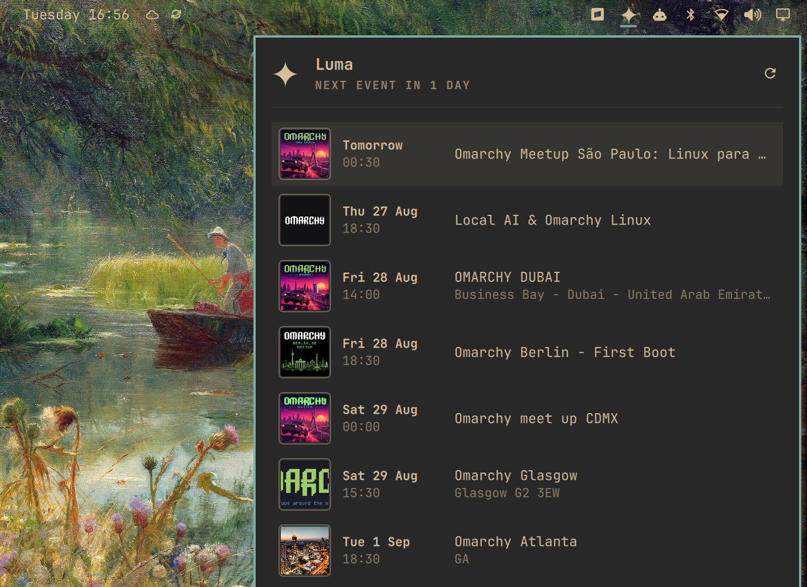

# Luma for Omarchy

A bar widget for the Omarchy Quattro shell that shows your upcoming [Luma](https://luma.com) events. It works out of the box with the standard Omarchy community calendar, and connects to your personal Luma feed with one command.



- The bar shows the Luma star mark in the same icon slot the built-in icon widgets
  use. The tooltip carries the countdown to the next event: the days until it, or
  the start time when it is today.
- The panel lists all upcoming events with cover art, date, time, name, and city,
  under a header with the next-event countdown and a refresh button.
- A click on a row opens the event page in the browser.

## Install

```bash
omarchy plugin add https://github.com/Meet-Miles/omarchy-luma-plugin --enable
```

The widget works immediately: it shows the standard Omarchy community calendar
([luma.com](https://luma.com) calendar `cal-SDGGMsEps9ExsrT`) until you connect
your own feed.

The plugin needs `curl`, `bash`, and GNU coreutils — Omarchy includes all of them.

## Connect your own calendar

Run the interactive setup and follow the prompts:

```bash
~/.config/omarchy/plugins/studiotwin.luma/setup
```

The script tells you where to find your iCal subscription link on luma.com, checks
that the link works, and stores it privately. Run it again at any time to change
the link, or type `remove` at the prompt to switch back to the community calendar.

<details>
<summary>Manual setup, if you prefer</summary>

1. Open [luma.com](https://luma.com) → profile **Settings** → **Calendar Syncing**
   (under Account Syncing).
2. Click **Add iCal Subscription** and copy the link (right-click a calendar-app
   option and select "Copy link address"). A `webcal://` link is also fine; the
   plugin converts it.
3. Create the private secrets file and write the link to it:

```bash
install -m 600 /dev/null ~/.config/omarchy/luma.env
echo 'LUMA_ICS_URL=https://api.lu.ma/ics/get?entity=calendar&id=...' > ~/.config/omarchy/luma.env
```

**The subscription link contains a secret token. Do not share it and do not put it
in a log or a repository.** The plugin refuses a secrets file with permissions
wider than `600` and shows a hint in the panel.

</details>

## Usage

| Input | Action |
| --- | --- |
| Left click | Open or close the panel |
| Right click or middle click | Refresh |
| `↑` / `↓` | Move through the rows |
| `Enter` | Open the selected event page |
| `R` or the header button | Refresh |
| `Escape` | Close the panel |

Shell commands:

```bash
omarchy-shell shell summon studiotwin.luma '{}'
omarchy-shell shell hide studiotwin.luma
```

The footer shows the time of the last good refresh, prefixed with `Omarchy calendar`
while the widget runs on the community calendar. When the network is not available,
the widget keeps the last data.

## Configure

Set the options in the bar layout entry for `studiotwin.luma`:

| Key | Type | Default | Description |
| --- | --- | --- | --- |
| `secretsFilePath` | string | `~/.config/omarchy/luma.env` | Path of the secrets file |
| `refreshIntervalSec` | integer | `1800` | Feed refresh interval in seconds (minimum `300`) |
| `maxEvents` | integer | `30` | Maximum number of rows in the panel (the list scrolls) |

## Remove

```bash
omarchy plugin remove studiotwin.luma
rm -f ~/.config/omarchy/luma.env
rm -rf ~/.cache/studiotwin.luma
```

The plugin writes no other files. Event data stays in memory only.

## Privacy and security

- The plugin does not write event data or feed URLs to disk, and does not log them.
- `lib/luma-fetch` reads the secrets file directly: the feed URL never appears in
  process arguments or in the shell process.
- For the cover art, the plugin downloads each event's public page once per machine
  and caches the resolved image URL in `~/.cache/studiotwin.luma` (public image
  URLs only, nothing personal); thumbnails load straight from Luma's image CDN.
- Demo mode uses fictional data only and contacts no network.

## Development

```bash
# Run the widget against fictional fixture data (no network, no secrets):
demo/run
demo/run --screenshot

# Data-layer tests:
node --test tests/model.test.js

# Validation:
omarchy plugin validate ~/.config/omarchy/plugins/studiotwin.luma
qmllint -I /usr/share/omarchy/shell BarWidget.qml Panel.qml LumaMark.qml
```

`qmllint` reports unqualified-access warnings for the shell singletons (`Style`,
`Color`, …); the built-in plugins show the same warnings and the shell resolves
them at runtime.

Notes for anyone touching the feed code, verified against live Luma feeds:

- Real feeds carry no `URL` property; the event page link is taken from
  `DESCRIPTION`, and a venue-less event carries its own page URL as `LOCATION`.
- Real feeds mark events `STATUS:TENTATIVE`; only `CANCELLED` is dropped.
- Event pages embed the square cover as `cover_url` in their JSON payload;
  `og:image` is the 800×420 social-card fallback.
- Cloudflare rate-limits the event pages (429). The cover queue fetches one page
  every 1.5 s and, on a 429, pauses with a doubling backoff (2 min up to 20 min) —
  keep it that way, or repeated testing gets the machine's IP limited for a while.
- Resolved cover URLs persist in `~/.cache/studiotwin.luma/covers` (one file per
  slug, written by `lib/luma-cover-store`), so each event page is fetched once per
  machine — not once per shell restart, which matters at install-base scale.
  Delete that directory to force a refetch while testing.

## License

MIT. See [LICENSE](LICENSE).
